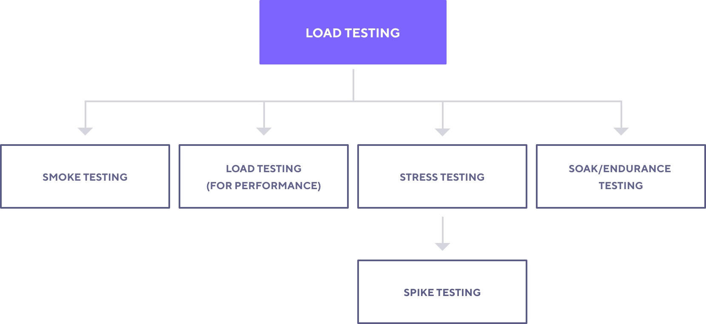
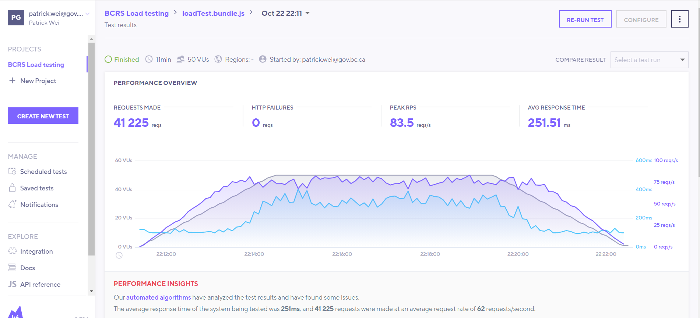

[](LICENSE)

# BC Registiries Load Testing
BC Registiries Load Testing is an automated SRE-driven performance Testing app to determine how BC Registries applications performs in terms of responsiveness and stability under a particular workload.

## Technology Stack Used

* [k6](https://github.com/loadimpact/k6) - is a modern and developer-centric load testing tool for API and website testing, tests are written in ES6 JS with support for HTTP/1.1, HTTP/2.0 and WebSocket protocols, written in Go.
* [Typescript](https://www.typescriptlang.org/) - is an open-source language which builds on JavaScript, one of the world’s most used tools, by adding static type definitions.

## Testing types

* **Smoke testing** is a regular load test, configured for minimal load. You want to run a smoke test as a sanity check every time you write a new script or modify an existing script.
* **Load testing** is primarily concerned with assessing the current performance of your system in terms of concurrent users or requests per second.
* **Spike testing** is primarily concerned with assessing the systems performance, the purpose of stress testing is to assess the availability and stability of the system under heavy load.
* **Soak testing** is concerned with reliability over a long time.



## Files in this repository

```
docs/           - Project Documentation
└── images

src/            - Source folder
├── actions     - test actions
└── helpers     - helper
└── tests       - test cases
└── types       - types
└── utils       - utilites
```

## Getting started

Install the [k6](https://docs.k6.io/docs/installation) and [yarn](https://yarnpkg.com/getting-started/install).

Clone this repository and open in the IDE of your choice.

Install dependencies using:

`yarn install`

Run the test locally:

`yarn smoke`

`yarn load`

`yarn spike`

`yarn soak`

Run the test in k6 cloud:

The [k6 Cloud](https://k6.io/cloud) is a cloud-based load testing service that complements k6 to accelerate and scale your performance testing.

`k6 login cloud -t <k6_CLOUD_TOKEN>`

`yarn smoke-cloud`

`yarn load-cloud`



## Running in CI/CD Pipelines

 [Local tests in GitHub Actions](https://github.com/bcgov/bcrs-testing/actions?query=workflow%3A%22Load+testing%22)

 [Cloud tests in GitHub Actions](https://github.com/bcgov/bcrs-testing/actions?query=workflow%3A%22Load+testing+Cloud%22)

